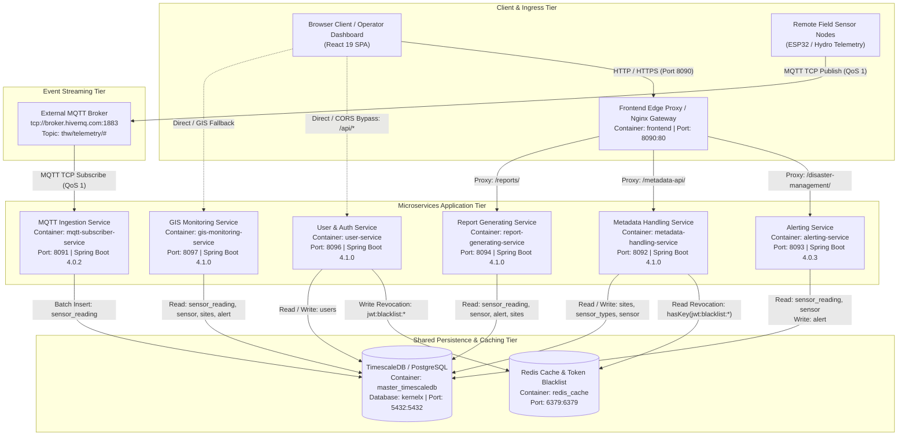
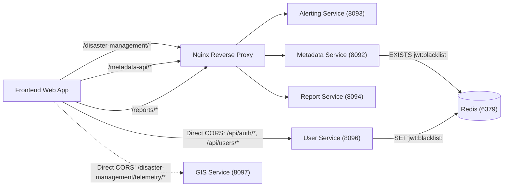
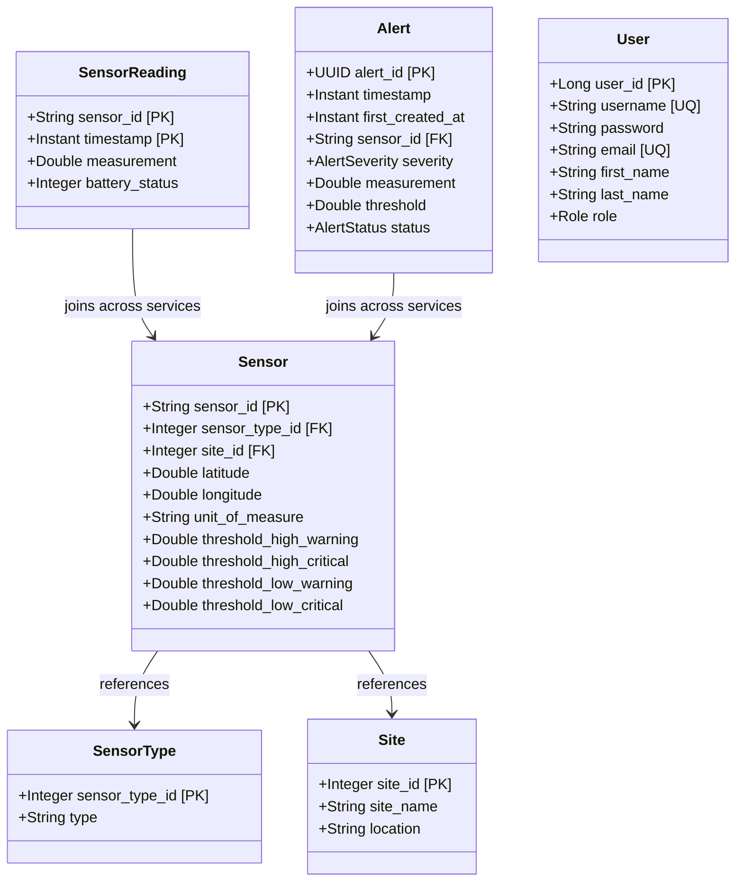
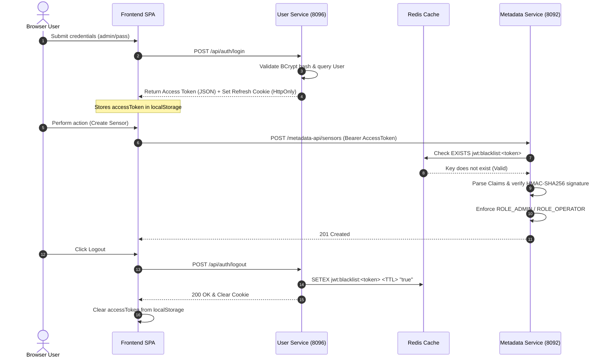
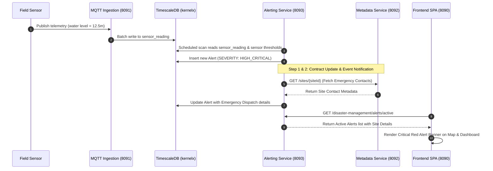
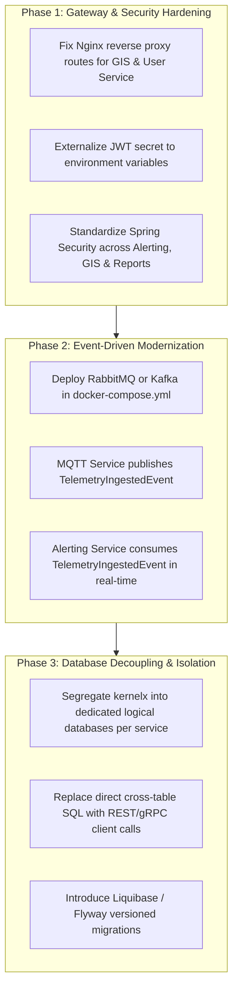

# ATLAS Distributed System Architecture & Engineering Guide
**Platform:** ATLAS (Adaptive Time-Series Analytics and Logging System) / Integrated Hydro Risk Management  
**Organization / Engineering Group:** KernelX (CO2060 Software Systems Design, Department of Computer Engineering, University of Peradeniya)  
**Document Status:** Definitive Architecture Baseline & Distributed Systems Reference  
**Audience:** Principal Architects, Tech Leads, Backend Engineers, DevOps / SRE, and Onboarding Developers

---

## 1. System Topology & Global Architecture

### 1.1 Ecosystem Mission & Domain Boundaries
ATLAS is an enterprise-grade, domain-agnostic distributed monitoring and time-series analytics platform. While engineered to be extensible to environmental, agricultural, and municipal IoT monitoring, its primary deployment topology is tailored for **Integrated Hydro Risk Management** across Sri Lanka's river basins (e.g., Kelani River, Mahaweli River, coastal and meteorological stations).

The ecosystem is decomposed into seven discrete services, separating responsibilities into distinct operational domains:
1. **IoT Ingestion Domain (`MQTT-Telemetry-Ingestion-Service`):** High-throughput, asynchronous ingestion of field telemetry (water level, precipitation, flow rates, battery health) from remote IoT edge nodes (ESP32/cellular loggers).
2. **Analytical Risk & Alerting Domain (`disaster-management-alerting-service`):** Continuous sliding-window evaluation of time-series telemetry against statutory hydrological safety thresholds to dynamically calculate risk severity and broadcast active alert states.
3. **Master Metadata Domain (`metadata-handling-service`):** Authoritative system of record for physical monitoring infrastructure, managing topological site hierarchies, sensor catalogs, measurement units, and threshold criteria.
4. **Geospatial & Spatial Projection Domain (`gis-monitoring-service`):** Read-optimized geospatial projection engine delivering GIS map layers, sensor spatial coordinates, live risk overlays, and time-series trend sparklines to mapping clients.
5. **Audit & Document Compilation Domain (`report-generating-service`):** On-demand reporting engine transforming raw telemetry and historical alert incident logs into exportable artifacts (PDF via Flying Saucer XML-to-PDF, CSV/Excel via Apache POI).
6. **Identity & Access Management Domain (`disaster-management-user-service`):** Centralized identity provider (IdP) handling authentication, credential encryption (BCrypt), JWT issuance, session lifecycle, token refresh rotation, and distributed revocation via Redis blacklists.
7. **Client Experience & Edge Proxy Domain (`disaster-management-frontend`):** Web Single Page Application (React 19 / Vite / Ant Design / Leaflet) co-located with an Nginx reverse-proxy ingress that serves client assets and routes requests across backend services.

---

### 1.2 Global Architecture Diagram



---

### 1.3 Service Catalog Matrix

| Service Name | Workspace Path / Git Submodule | Domain / Responsibility | Runtime & Framework | Port(s) | Primary Data Store | Sync Protocols | Async Topics (Pub / Sub) |
|---|---|---|---|---|---|---|---|
| **`mqtt-service`** (`mqttSubscriber`) | `MQTT-Telemetry-Ingestion-Service` | Ingests high-frequency sensor streams from edge devices; validates DTOs and performs scheduled batch persistence. | Java 21, Spring Boot 4.0.2, Eclipse Paho 1.2.5 | `8091` (Internal `8091`) | TimescaleDB (`sensor_reading`) | None (Internal Spring Actuator only) | **Sub:** `thw/telemetry/#` (MQTT QoS 1) |
| **`alerting-service`** (`alerts`) | `alerting service/disaster-management-alerting-service` | Runs scheduled sliding-window threshold checks; computes alert escalation/de-escalation; queries active alerts. | Java 21, Spring Boot 4.0.3 | `8093` (Internal `8093`) | TimescaleDB (`alert`, reads `sensor_reading`, `sensor`) | REST / HTTP (`/disaster-management/alerts/*`) | None (Cron poller: `0 */1 * * * *`) |
| **`metadata-handling-service`** (`metadatahandling`) | `metadata-handling service` | Authoritative CRUD management for geographical sites, sensor categories, and hardware threshold limits. Enforces JWT auth. | Java 21, Spring Boot 4.1.0, Spring Security, JJWT | `8092` (Internal `8092`) | TimescaleDB (`sites`, `sensor_types`, `sensor`), Redis | REST / HTTP (`/sensors`, `/sensor-types`, `/sites`) | None (Sync Redis query for revoked JWTs) |
| **`user-service`** (`user`) | `user service/disaster-management-user-service` | Identity Provider: User accounts, BCrypt authentication, JWT generation, token refresh rotation, and logout token revocation. | Java 21, Spring Boot 4.1.0, Spring Security, JJWT | `8096` (Internal `8096`) | TimescaleDB (`users`), Redis | REST / HTTP (`/api/auth/*`, `/api/users/*`) | None (Writes blacklist keys to Redis) |
| **`gis-monitoring-service`** (`gis-monitoring-service`) | `gis-monitoring-service` | Spatial projection engine aggregating sensor locations, live threshold markers, and historical telemetry sparklines. | Java 21, Spring Boot 4.1.0 | `8097` (Internal `8097`) | TimescaleDB (Reads `sensor`, `sites`, `sensor_reading`, `alert`) | REST / HTTP (`/disaster-management/telemetry/*`, `/disaster-management/sensors/*`) | None |
| **`report-generating-service`** (`report-generating-service`) | `report-generation-service/report-generating-service` | Dynamic compilation of historical audit logs into downloadable PDF (Flying Saucer) and CSV (Apache POI) formats. | Java 17 / JRE 21, Spring Boot 4.1.0, Thymeleaf | `8094` (Internal `8094`) | TimescaleDB (Reads `sensor_reading`, `sensor`, `alert`, `sites`) | REST / HTTP (`/reports/alerts/*`, `/reports/telemetry/*`) | None |
| **`frontend`** (`disaster-management-frontend`) | `frontend/disaster-management-frontend` | React 19 SPA dashboard for operators and administrators. Acts as the system's edge reverse proxy via containerized Nginx. | Node 20, Vite 7.3.1, React 19, Nginx Alpine | `8090` (Mapped to internal `80`) | Browser Storage (`localStorage`, HttpOnly Cookies) | HTTP Client (Axios) to edge proxy & direct backends | None |

---

## 2. Communication Contracts & Protocols

### 2.1 Synchronous RPC & HTTP Topology

#### Ingress & Gateway Routing Map
The production edge gateway is hosted within the `frontend` container running Nginx, while local development leverages Vite's internal development proxy.

```
+-------------------------------------------------------------------------------------------------------------------------+
|                                           EDGE REVERSE PROXY ROUTING TABLE                                              |
+--------------------------+-----------------------+---------------------------------------+------------------------------+
| Public Ingress Path      | Dev Target (Vite)     | Prod Target (Docker Nginx)            | Upstream Destination         |
+--------------------------+-----------------------+---------------------------------------+------------------------------+
| /                        | http://localhost:8090 | /usr/share/nginx/html                 | React SPA Static Distribution|
| /disaster-management/    | http://localhost:8093 | http://alerting-service:8093/         | alerting-service             |
| /metadata-api/           | http://localhost:8092 | http://metadata-handling-service:8092/| metadata-handling-service    |
| /reports/                | http://localhost:8094 | http://report-generating-service:8094/| report-generating-service    |
| /mqtt-api/ [Broken]      | [Not configured]      | http://mqtt-service:8080/ [Mismatch]  | Unreachable (Port & API gap) |
| /api/auth/* [Bypassed]   | http://localhost:8096 | [Bypassed via Direct Host Port 8096]  | user-service                 |
| /api/users/* [Bypassed]  | http://localhost:8096 | [Bypassed via Direct Host Port 8096]  | user-service                 |
| /disaster-management/    | [Routes to 8093!]     | [Routes to alerting-service:8093!]    | gis-monitoring-service       |
|  telemetry/* [Collided]  |                       |                                       | (Yields 404 in Gateway)      |
+--------------------------+-----------------------+---------------------------------------+------------------------------+
```

#### Inter-Service Call Graph


*Critical Architectural Finding:* Aside from the distributed Redis token check between `metadata-handling-service` and `user-service`, **no backend microservice executes synchronous HTTP/REST or gRPC calls to any other backend service**. Microservices rely on database-level coupling to read data created by upstream systems.

#### Contract & Schema Specifications
- **Metadata Handling Service:** Exposes OpenAPI 3.0 / Swagger UI documentation at `/swagger-ui.html` and `/v3/api-docs` (driven by `org.springdoc:springdoc-openapi-starter-webmvc-ui:3.0.0`).
- **User & Auth Service:** Exposes OpenAPI 3.0 specifications at `/swagger-ui.html` and `/v3/api-docs` (driven by `springdoc-openapi-starter-webmvc-ui:2.6.0`).
- **Alerting, GIS, Reporting, and MQTT Services:** Do not publish formal OpenAPI specifications or Protocol Buffer definitions; communication contracts are implicitly established through Java DTO classes.

---

### 2.2 Event-Driven & Asynchronous Messaging

#### Event Topology
```
+----------------------------------------------------------------------------------------------------------------------------+
|                                                 ASYNCHRONOUS EVENT TOPOLOGY                                                |
+-------------------+--------------------+------------------------+-------------------+---------------+----------------------+
| Event Identifier  | Producer System    | Consumer Service(s)    | Protocol & Topic  | QoS / Delivery| Persistence Buffer   |
+-------------------+--------------------+------------------------+-------------------+---------------+----------------------+
| TelemetryReading  | Remote IoT Nodes / | mqtt-service           | MQTT v3.1.1       | QoS 1         | In-memory Queue ->   |
|                   | ESP32 Field Units  | (`mqttSubscriber`)     | `thw/telemetry/#` | At-least-once | Scheduled DB Flush   |
+-------------------+--------------------+------------------------+-------------------+---------------+----------------------+
```

#### Event Payload Schema & Envelope Conventions
Remote field hardware formats payloads as JSON strings delivered over MQTT TCP:
```json
{
  "deviceId": "KELANI_STATION_01",
  "timestamp": "2026-09-24T00:15:30.000Z",
  "value": 7.42,
  "sensorHealth": 95
}
```

- **Validation Rules:** Ingested payloads are deserialized into `com.kernelx.mqttSubscriber.entity.dto.TelemetryDTO` and inspected against Jakarta Bean Validation constraints:
  - `deviceId`: Must not be blank (maps to `sensor_id`).
  - `timestamp`: Valid ISO-8601 Instant format.
  - `value`: Non-null numeric telemetry reading.
  - `sensorHealth`: Integer percentage representing battery/signal status.
- **Envelope Deficiencies:** The event schema lacks standard enterprise metadata envelope wrappers (no distributed `correlationId`, `eventId` UUID, `schemaVersion`, or origin header metadata).

#### Idempotency & Batching Semantics
- **Batch Buffering:** `MqttSubscriber.java` handles MQTT callbacks on worker threads and enqueues records into a non-blocking `ConcurrentLinkedQueue<Telemetry>` in `TelemetryService.java`.
- **Scheduled Flush:** Every 8,000 milliseconds (`@Scheduled(fixedRate = 8000)`), the buffer is drained into a staging batch list and committed via `TelemetryRepository.saveAll(batch)` within a `@Transactional` boundary.
- **Deduplication Mechanism:** The destination table `sensor_reading` uses a composite primary key consisting of `(sensor_id, timestamp)`. Under PostgreSQL/Hibernate, duplicate entries with the exact same device ID and timestamp will trigger a primary key violation unless handled via SQL `ON CONFLICT DO UPDATE/NOTHING`.
- **Shutdown Resilience:** An `@PreDestroy` lifecycle hook in `TelemetryService` invokes `flushBuffer()` to minimize in-flight data loss upon container SIGTERM signals.

---

## 3. Distributed Data & Transaction Management

### 3.1 Persistence Boundary Rules & Isolation Verification

In a textbook microservices architecture, each microservice encapsulates its own persistent store (Database-per-Service pattern). During this audit, an inspection of `docker-compose.yml` and each service's `application.yml` revealed **a universal Shared-Database Anti-Pattern**:

```
+----------------------------------------------------------------------------------------------------------------+
|                                    PERSISTENCE DOMAIN ISOLATION AUDIT                                         |
+---------------------------+-----------------------+-----------------------------+------------------------------+
| Service Name              | Configured Database   | Target Tables Written       | Foreign Tables Read Directly |
+---------------------------+-----------------------+-----------------------------+------------------------------+
| mqtt-service              | PostgreSQL: kernelx   | sensor_reading              | None                         |
| alerting-service          | PostgreSQL: kernelx   | alert                       | sensor_reading, sensor       |
| metadata-handling-service | PostgreSQL: kernelx   | sites, sensor_types, sensor | None                         |
| user-service              | PostgreSQL: kernelx   | users                       | None                         |
| gis-monitoring-service    | PostgreSQL: kernelx   | None                        | sensor, sites, alert,        |
|                           |                       |                             | sensor_reading               |
| report-generating-service | PostgreSQL: kernelx   | None                        | sensor_reading, sensor,      |
|                           |                       |                             | alert, sites                 |
+---------------------------+-----------------------+-----------------------------+------------------------------+
```



#### Shared Database Coupling Risks
1. **Schema Fragility:** If `metadata-handling-service` alters columns on `sensor` or `sites`, both `alerting-service`, `gis-monitoring-service`, and `report-generating-service` will fail at runtime on JPA entity mapping exceptions.
2. **DDL Clashes:** All backend services run `hibernate.ddl-auto: update` concurrently pointing at `kernelx`. During simultaneous container boot, race conditions occur during DDL execution and index creation.
3. **Database Contention:** Heavy analytical PDF queries from `report-generating-service` lock rows and saturate database I/O, degrading write throughput for `mqtt-service` batch inserts.

---

### 3.2 Consistency Models & Distributed Sagas

The ATLAS ecosystem adopts an **Eventual Consistency** model driven by polling and cache invalidation:
- **Alert Generation Saga:** Rather than using an event-driven Saga (e.g., MQTT -> Kafka -> Alerting Service via choreography), the system implements an internal Cron Poller (`AlertScheduler.java` executing `0 */1 * * * *`). The alerting service scans the previous 10-minute sliding window of `sensor_reading` rows, joins with `sensor` threshold boundaries, upserts active alerts, auto-resolves healed alerts, and purges resolved alerts older than 1 day.
- **Distributed Token Invalidation:** When a user logs out (`/api/auth/logout`), `user-service` writes the JWT string into Redis under the key `jwt:blacklist:<token>` with a TTL matching the token's remaining lifespan. When subsequent mutating requests strike `metadata-handling-service`, `JwtAuthenticationFilter` queries Redis to verify whether the token has been revoked before authenticating the request.

---

## 4. Cross-Cutting Distributed Concerns

### 4.1 Authentication & Context Propagation



#### Authentication Matrix
- **Issuer / Identity Provider:** `user-service`
- **Signing Algorithm:** Symmetric HMAC-SHA256 (`Keys.hmacShaKeyFor(...)`).
- **Token Lifespans:** Access Token: 15 minutes (`jwt.expiration: 900000`); Refresh Token: 24 hours (`jwt.refresh-expiration: 86400000`).
- **Secret Distribution Vulnerability:** Both `user-service` and `metadata-handling-service` duplicate the identical plaintext secret key in `application.yaml`:
  `404E635266556A586E3272357538782F413F4428472B4B6250645367566B5970`
- **Security Discrepancy:** While `user-service` and `metadata-handling-service` enforce strict Spring Security and JWT checks, the remaining services (`alerting-service`, `gis-monitoring-service`, `report-generating-service`, `mqtt-service`) possess **no security filters** and accept unauthenticated HTTP calls.

---

### 4.2 Distributed Observability & Tracing
- **Correlation ID Propagation:** There is currently no correlation ID or distributed trace context (W3C `traceparent` / `tracestate`) propagated across HTTP request headers or MQTT event payloads.
- **Trace Context Continuity:** Because the system communicates asynchronously via database polling rather than direct RPC or message envelopes, standard distributed tracing spans break at the database boundary.
- **Logging Pipeline:** All Spring Boot microservices utilize SLF4J / Logback with standard synchronous console appenders:
  `%d{yyyy-MM-dd HH:mm:ss} [%thread] %-5level %logger{36} - %msg%n`
  The `mqtt-service` also maintains rotating local disk logs in `logs/application.%d.log` and `logs/warn-error.%d.log`.

---

### 4.3 Resilience & Fault Tolerance
- **Circuit Breakers:** No circuit breakers (e.g., Resilience4j) are configured. Upstream slowdowns directly degrade downstream callers.
- **Client-Side Refresh Interceptor:** The Frontend Axios client (`src/services/api.js` and `metadataApi.js`) contains an interceptor that catches HTTP 401s, locks duplicate requests, invokes `/api/auth/refresh-token` with credentials, saves the updated access token, and transparently retries the failed API call.
- **Redis Fail-Open Fallback:** In `metadata-handling-service` (`JwtAuthenticationFilter.java`), if the Redis connection fails or times out, the blacklist check catches the exception and fails open, allowing signed JWTs to process rather than triggering an outage.

---

## 5. Local Orchestration & Developer Workflows

### 5.1 System Prerequisites & Resource Allocation
Running the entire 7-service ATLAS ecosystem locally requires sufficient system resources:
- **Container Engine:** Docker Desktop (Windows/macOS) or Docker Engine + Compose v2.20+ (Linux).
- **RAM Allocation:** Minimum 8 GB available RAM (12 GB recommended). Each Spring Boot JVM requires ~512MB-1GB RSS memory, plus TimescaleDB and React/Node build tools.
- **Port Availability:** Ensure host ports `5432`, `6379`, `8090`, `8091`, `8092`, `8093`, `8094`, `8096`, and `8097` are unallocated.

---

### 5.2 Ecosystem Spin-Up Sequences

#### Full Automated Spin-Up (Docker Compose)
The root orchestration manifest is located at `disaster management system/e22-co2060-hydro-risk-management/docker-compose.yml`.

```powershell
# Navigate to the compose root
cd "c:\Users\ravin\Academics\Semester 03\Second Year Project\disaster management system\e22-co2060-hydro-risk-management"

# Build all container images and launch the cluster in detached mode
docker compose up --build -d

# Verify operational status of all 9 containers
docker compose ps
```

To tail logs for all services or a specific service:
```powershell
# Tail cluster logs
docker compose logs -f

# Tail specific microservice logs
docker compose logs -f alerting-service
docker compose logs -f mqtt-service
```

---

### 5.3 Selective Execution (Hybrid Local Dev + Docker Infrastructure)
When developing a single service (e.g., `alerting-service`), do not run all 7 services in Docker. Spin up shared databases and dependent containers while executing your target service directly inside your IDE:

```powershell
# 1. Spin up only the core infrastructure backing services
docker compose up -d db redis

# 2. Optionally start support services (e.g., metadata and user service)
docker compose up -d metadata-handling-service user-service

# 3. Launch target service locally in development mode (e.g., Alerting Service)
cd "c:\Users\ravin\Academics\Semester 03\Second Year Project\alerting service\disaster-management-alerting-service"
.\mvnw.cmd spring-boot:run

# 4. Launch Frontend in Vite development mode
cd "c:\Users\ravin\Academics\Semester 03\Second Year Project\frontend\disaster-management-frontend"
npm run dev
```

---

### 5.4 Environment & Secret Configuration
The platform's microservices rely on Spring Boot configuration overlays:
- **Container Environment:** Injected via `docker-compose.yml` environment blocks (e.g., `SPRING_DATASOURCE_URL=jdbc:postgresql://db:5432/kernelx`).
- **Local Dev Overrides:** Each service defaults to `localhost` in its internal `application.yml` / `application.yaml` file (`jdbc:postgresql://localhost:5432/kernelx`, `redis: localhost:6379`).
- **Database Password Override:** `alerting-service` requires `${DB_PASSWORD}` to be supplied or defaulted:
  ```powershell
  $env:DB_PASSWORD="kernelx"
  ```

---

## 6. Cross-Service Feature Recipe: Adding an Alert Notification Channel

This walkthrough guides an engineer through adding a cross-boundary distributed feature:  
*When a sensor threshold is breached, the Alerting Service generates an alert, emits an event, the Metadata Service enriches it with site contact details, and the Frontend displays a real-time notification banner.*



### Step 1: Contract & Entity Updates
1. **Update Alert Entity (`alerting-service`):**  
   Add `site_contact_notified` column in `Alert.java`:
   ```java
   @Column(name = "site_contact_notified")
   private Boolean siteContactNotified = false;
   ```
2. **Update Response DTO (`ActiveAlertResponse.java`):**  
   Add `siteContactName` and `sitePhone` fields to the API contract.

### Step 2: Consumer / Producer Communication
Because there is no internal message broker between `alerting-service` and `metadata-handling-service`, introduce a synchronous REST client using Spring's `RestClient` or `WebClient` in `alerting-service`:

```java
@Service
@RequiredArgsConstructor
public class MetadataClient {
    private final RestClient restClient = RestClient.builder()
            .baseUrl("http://metadata-handling-service:8092")
            .build();

    public SiteDto getSiteDetails(Integer siteId) {
        return restClient.get()
                .uri("/sites/{id}", siteId)
                .retrieve()
                .body(SiteDto.class);
    }
}
```

### Step 3: Service Logic Integration
In `AlertsServiceImpl.java`:
```java
if (alertSeverityDto != null && activeAlert == null) {
    SiteDto site = metadataClient.getSiteDetails(sensorMetadata.getSiteId());
    log.info("Disaster alert triggered! Emergency site lead: {}", site.getSiteName());
    // Persist new alert with site dispatch info
}
```

### Step 4: Gateway & Frontend Route Wiring
1. Ensure `nginx.conf` preserves the reverse proxy rule for both `/disaster-management/` and `/metadata-api/`.
2. In `frontend/src/services/alertsApi.js`, update the mapper to parse `site_contact_name`:
   ```javascript
   export const getActiveAlerts = async () => {
       const response = await alertsApi.get('/active');
       return response.data.map(alert => ({
           ...alert,
           siteContact: alert.siteContactName
       }));
   };
   ```

### Step 5: Multi-Service Verification
Run the verification sequence using PowerShell:
```powershell
# 1. Trigger simulated high-reading alert generation manually
Invoke-RestMethod -Uri "http://localhost:8093/disaster-management/alerts/create" -Method GET

# 2. Verify active alerts endpoint returns enriched payload
$response = Invoke-RestMethod -Uri "http://localhost:8093/disaster-management/alerts/active" -Method GET
$response | ConvertTo-Json -Depth 3

# 3. Verify through Nginx Ingress Proxy
Invoke-RestMethod -Uri "http://localhost:8090/disaster-management/alerts/active" -Method GET
```

---

## 7. Architectural Anti-Patterns & Bottlenecks

During the deep-dive audit of all 7 codebases, seven major structural anti-patterns and performance bottlenecks were verified:

### 1. The Shared-Database Anti-Pattern (High Risk)
- **Finding:** Every backend service (`mqtt-service`, `alerting-service`, `metadata-handling-service`, `user-service`, `gis-monitoring-service`, `report-generating-service`) connects directly to the single `kernelx` database.
- **Impact:** Tight temporal and schema coupling. `gis-monitoring-service` and `alerting-service` directly query tables owned by `metadata-handling-service` (`sensor`, `sites`) and `mqtt-service` (`sensor_reading`). A breaking schema change in one service will silently break three other services without compile-time warnings.

### 2. Missing Message Broker for Cross-Service Events (Architectural Gap)
- **Finding:** The ecosystem only uses MQTT at the external edge for raw device ingestion. There is no internal event bus (such as Apache Kafka, RabbitMQ, or AWS SQS).
- **Impact:** Services rely on periodic polling of raw database tables (e.g., `AlertScheduler` running a cron job every minute scanning `sensor_reading`). This leads to high database CPU utilization, lock contention, and latency in alert dispatching.

### 3. Ingress Reverse Proxy Configuration Drift & Dead Routes (Operational Bug)
- **Finding:** In `frontend/nginx.conf`:
  - Route `/mqtt-api/` forwards to `http://mqtt-service:8080/`, while `docker-compose.yml` runs `mqtt-subscriber-service` on port `8091`. Furthermore, `mqtt-service` has no HTTP REST controllers.
  - Route `/disaster-management/` is routed entirely to `alerting-service:8093`. However, `gis-monitoring-service:8097` also defines routes under `/disaster-management/sensors` and `/disaster-management/telemetry`. Requests to these endpoints through Nginx fail with HTTP 404.
  - Routes for `user-service` (`/api/auth/*`, `/api/users/*`) are omitted from `nginx.conf`, forcing the frontend to bypass the gateway and make cross-origin requests to `http://localhost:8096`.

### 4. Hardcoded Symmetric Secrets Across Repositories (Security Vulnerability)
- **Finding:** Both `metadata-handling-service/src/main/resources/application.yml` and `user-service/src/main/resources/application.yaml` contain the identical HMAC-SHA256 secret key committed directly into source code:
  `404E635266556A586E3272357538782F413F4428472B4B6250645367566B5970`
- **Impact:** A compromise in any repository invalidates the security boundary of the entire authentication infrastructure. Secret rotation requires coordinated redeployment of multiple microservices.

### 5. Inconsistent Security Perimeter (Perimeter Gap)
- **Finding:** Only `user-service` and `metadata-handling-service` implement authentication filters. `alerting-service`, `gis-monitoring-service`, and `report-generating-service` do not include `spring-boot-starter-security` and expose all HTTP endpoints publicly without token validation.
- **Impact:** Any client or container within the network can query sensitive disaster alerts, trigger report compilation, or download telemetry without authentication.

### 6. Unbounded In-Memory Ingestion Queue (Memory Leak / OOM Risk)
- **Finding:** In `MQTT-Telemetry-Ingestion-Service`, incoming MQTT messages are buffered into an unbounded `ConcurrentLinkedQueue<Telemetry>` in `TelemetryService.java`.
- **Impact:** If TimescaleDB slows down or experiences a connection pool lockup, the batch insert task will fail or stall while the MQTT client continues to enqueue messages. Under high sensor load, this leads to an unrecoverable `java.lang.OutOfMemoryError` (OOM) and JVM crash.

### 7. Java Runtime Version Divergence
- **Finding:** 6 services are standardized on Java 21, but `report-generating-service/pom.xml` targets `<java.version>17</java.version>` while its Dockerfile compiles against `maven:3.9.11-eclipse-temurin-21`.
- **Impact:** Potential bytecode incompatibility and inconsistent JVM garbage collection behavior across containers in production.

---

## 8. Strategic Architecture Roadmap & Remediation

To graduate ATLAS from an academic prototype to a resilient, high-assurance government platform, execute the following phased refactoring plan:



1. **Phase 1: Ingress Gateway & Security Remediation (Immediate):**
   - Correct `nginx.conf` in `frontend` to route `/api/` to `user-service:8096` and `/disaster-management/telemetry/` to `gis-monitoring-service:8097`.
   - Remove hardcoded JWT secrets and inject `JWT_SECRET` via environment variables.
   - Add JWT validation filters to `alerting-service`, `gis-monitoring-service`, and `report-generating-service`.
2. **Phase 2: Event-Driven Decoupling:**
   - Introduce RabbitMQ or Apache Kafka into `docker-compose.yml`.
   - Transition `alerting-service` from database cron polling to real-time event streaming by consuming `telemetry.recorded` events directly from the broker.
3. **Phase 3: Database Domain Isolation:**
   - Migrate from a single shared `kernelx` database to dedicated schemas or database instances per microservice (`atlas_telemetry`, `atlas_metadata`, `atlas_alerts`, `atlas_users`).
   - Eliminate direct cross-boundary queries by establishing resilient HTTP or gRPC client interfaces between services.
